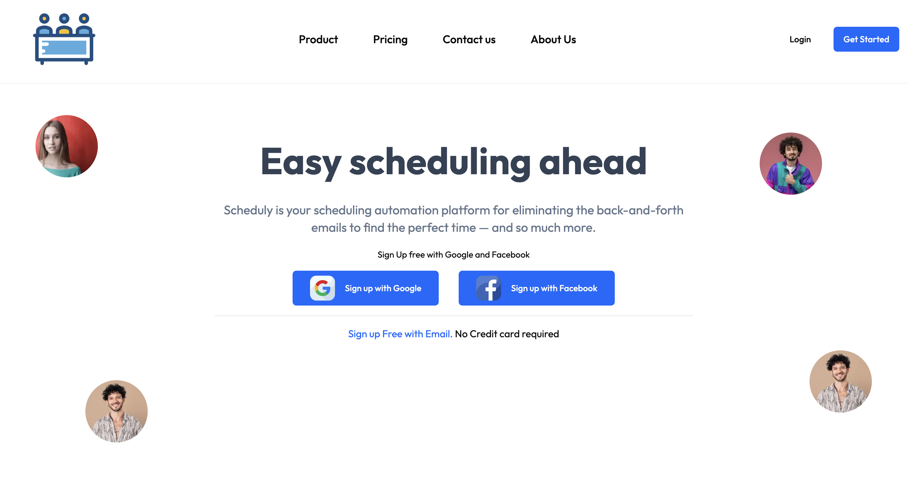
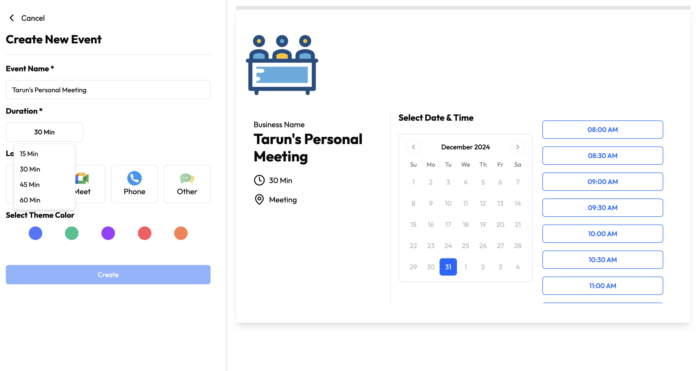

# MeetEase

MeetEase is a seamless meeting scheduling platform designed to simplify the process of organizing meetings with clients and team members. It features a user-friendly interface, customizable time slots, and real-time booking management.

## Features

- **Dynamic Time Slot Creation**: Automatically generates time slots based on business hours and event durations.
- **Real-Time Meeting Availability**: Displays available slots and prevents double bookings.
- **Firebase Integration**: Stores scheduled meetings and user data securely using Firestore.
- **Plunk Email Integration**: Sends meeting confirmation emails with personalized details.
- **Custom Themes**: Allows businesses to style their booking pages with theme colors.
- **Responsive Design**: Optimized for all devices, including desktops, tablets, and mobile phones.

## Technologies Used

- **Frontend**: Next.js, Tailwind CSS, React
- **Backend**: Firebase Firestore
- **Email**: Plunk API with React Email
- **Icons**: Lucide React
- **Hosting**: Vercel

## Installation

Follow these steps to set up MeetEase locally:

### Prerequisites

- Node.js and npm installed
- Firebase project configured with Firestore
- Plunk account with API key

### Clone the Repository
```bash
git clone https://github.com/tarun05rawat/MeetEase.git
cd MeetEase
```

### Install Dependencies
```bash
npm install
```

### Set Up Environment Variables

Create a `.env.local` file in the root directory and add the following:

```env
NEXT_PUBLIC_PLUNK_API_KEY=your_plunk_api_key
NEXT_PUBLIC_FIREBASE_API_KEY=your_firebase_api_key
NEXT_PUBLIC_FIREBASE_AUTH_DOMAIN=your_firebase_auth_domain
NEXT_PUBLIC_FIREBASE_PROJECT_ID=your_firebase_project_id
NEXT_PUBLIC_FIREBASE_STORAGE_BUCKET=your_firebase_storage_bucket
NEXT_PUBLIC_FIREBASE_MESSAGING_SENDER_ID=your_messaging_sender_id
NEXT_PUBLIC_FIREBASE_APP_ID=your_firebase_app_id
```

Replace the placeholder values with your Firebase and Plunk credentials.

### Start the Development Server
```bash
npm run dev
```

The application will be available at `http://localhost:3000`.

## Deployment

To deploy the application, use [Vercel](https://vercel.com/). Add the same environment variables in the Vercel dashboard under **Settings > Environment Variables**.

## Usage

1. **Set Up Your Business Information**:
   - Configure available days, theme colors, and meeting durations.

2. **Invite Users**:
   - Share the meeting booking page URL.

3. **Schedule Meetings**:
   - Users can select an available slot and book a meeting.
   - Confirmation emails are sent automatically.

4. **Manage Bookings**:
   - Access scheduled meetings via Firestore.

## Folder Structure

```
/@components
  /ui           # Reusable UI components (e.g., Button, Calendar)
  /_components  # Page-specific components
/app
  /routes       # Route-specific logic
/config         # Firebase configuration
/emails         # Email templates for confirmation emails
/lib            # Utility functions
/public         # Static assets
```

## Screenshots

  
_Home page with a clean, user-friendly interface._

  
_Customizable booking page with dynamic time slot creation._

## Contributions

Contributions are welcome! If you’d like to contribute to this project:

1. Fork the repository.
2. Create a new branch (`git checkout -b feature-name`).
3. Commit your changes (`git commit -m "Add a new feature"`).
4. Push to your branch (`git push origin feature-name`).
5. Open a pull request.

## License

This project is licensed under the MIT License. See the [LICENSE](LICENSE) file for more details.

## Contact

For questions or support, feel free to reach out:

- **Author**: Tarun Rawat  
- **GitHub**: [tarun05rawat](https://github.com/tarun05rawat)  
- **Email**: tarun@example.com
